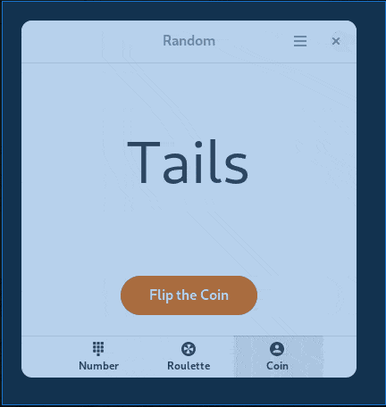
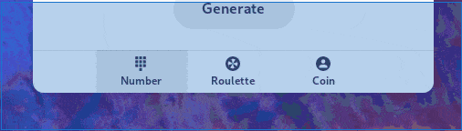
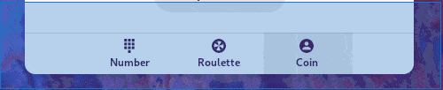

# Random
Random aims to make randomization easy. But, just in case it is not easy, these help pages will make using Random very easy.
#### This might take a really long time to load. Apologies.
## Contents
* [How to pick a number](#how-to-pick-a-number)
* [How to pick an item in Roulette](#how-to-pick-an-item-in-roulette)
    + [Why the separator?](#why-the-separator)
* [Switching between the views](#switching-between-the-views)
## How to pick a number
Random will launch in the *Number* view, denoted by a keypad in the view switcher. To generate a number, you need to have a range of numbers; for this example, that range is from 15 to 30. You put your lower number in the **first box** and the higher number in the **second box**. For our exaple, 15 goes in the first box and 30 goes into the second. Then, click the *Generate* button to generate a number, or press `Ctrl` + `G` on your keyboard. You can see how it's done below (click on the image for a moving version):

## How to pick an item in Roulette
You will have to [switch views](#switching-between-the-views) to use the *Roulette* view. To roll the *Roulette* wheel, you have to have a list, and a separator. Let's consider the list `A, B, C, D`. That list would be the list, and the separator would be `, ` with that extra space. Paste or write your list in the long box, and in the short box write in your separator. Then, click the *Pick* button, or press `Ctrl` + `G` to spin the *Roulette* wheel. You can see how it's done below (click on the image for a moving version):

### Why the separator?
Due to how *Random* works, you need a separator to separate the contents of the list. *Random* cannot automatically detect your separator.
## How to flip a coin
You will have to [switch views](#switching-between-the-views) to use the *Coin* view. To flip a coin in Random, you simply press the "Flip" button or `Ctrl` + `G` , and it will flip the coin and give you a result of heads or tails. You can see how it's done below (click on the image for a moving version):

## Switching between the views
In *Random*, there are 3 ways to switch between the views. Here are those 3 ways.
### 1: With the Mouse
Click on the views in the View switcher.

### 2: With Tab and Enter
You can use `Tab` or the arrow keys to switch between focus on the view buttons and press `Enter` to select that view.

### 3: Using a keyboard shortcut
You can use `Ctrl` + `Tab` to switch between views.

## Converting from Number to Roulette